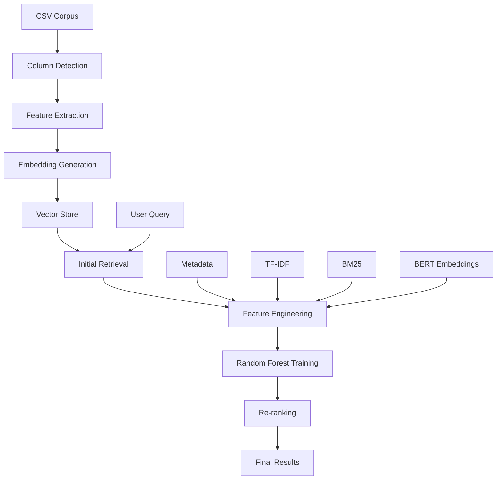

# 🎯 Metadata-Aware Retrieval Optimization for RAG Systems

A production-ready RAG (Retrieval-Augmented Generation) system that optimizes document retrieval using advanced machine learning techniques and metadata-aware ranking.

[](https://www.python.org/downloads/)
[](https://streamlit.io/)

## 🚀 **Key Features**

- **🎯 High Accuracy**: 98.67% test accuracy with 96.68% F1-score
- **🔧 Flexible CSV Support**: Works with any CSV structure automatically
- **📊 Advanced Features**: 18+ comprehensive ranking features
- **🤖 Hybrid Approach**: Combines BERT embeddings, TF-IDF, and BM25
- **📈 Anti-Overfitting**: Robust cross-validation and regularization
- **🎨 Interactive Dashboard**: Beautiful Streamlit interface with real-time analysis
- **⚡ Production Ready**: Scalable pipeline for large datasets

## 🏗️ **Architecture Overview**



## 🧠 **Why Hybrid Approach? (TF-IDF + BM25 + BERT)**

### **Different Types of Similarity**
- **🔤 BERT Embeddings**: Semantic understanding and context
- **📝 TF-IDF**: Keyword frequency and document specificity  
- **🎯 BM25**: Advanced keyword ranking with length normalization

### **Complementary Strengths**
| Query Type | Best Method | Example |
|------------|-------------|---------|
| Conceptual | BERT | "What is machine learning?" |
| Keyword | TF-IDF | "Python programming tutorial" |
| Multi-term | BM25 | "advanced Python data science" |

### **Real-World Benefits**
- **Robustness**: If BERT fails on domain terms, TF-IDF/BM25 provide fallback
- **Performance**: Ensemble approaches outperform single methods
- **Production**: Used by Google, academic systems, and enterprise applications

## 📊 **Feature Engineering**

Our system extracts **18 comprehensive features**:

### **Core Features**
- `rank_pos`: Original retrieval position (42.4% importance)
- `cosine_sim`: Semantic similarity via BERT (11.0% importance)
- `tfidf_cosine`: Lexical similarity via TF-IDF (15.1% importance)
- `bm25_score`: Advanced keyword ranking

### **Metadata Features**
- `citations`: Document citation count
- `source_score`: Source credibility score
- `recency`: Document freshness (days old)
- `token_length`: Document length

### **Text Features**
- `keyword_overlap`: Query-document keyword overlap
- `jaccard_sim`: Jaccard similarity coefficient
- `title_keyword_overlap`: Title relevance
- `num_count`, `url_count`, `email_count`: Content statistics

## 🛠️ **Installation**

### **Prerequisites**
```bash
Python 3.8+
```

### **Setup**
```bash
# Clone the repository
git clone https://github.com/yourusername/metadata-aware-rag.git
cd metadata-aware-rag

# Install dependencies
pip install -r requirements.txt

# Set up environment
export PYTHONPATH="${PYTHONPATH}:$(pwd)/src"
```

### **Dependencies**
```
streamlit>=1.28.0
pandas>=1.5.0
numpy>=1.24.0
scikit-learn>=1.3.0
sentence-transformers>=2.2.0
faiss-cpu>=1.7.4
plotly>=5.15.0
rank-bm25>=0.2.2
tqdm>=4.65.0
joblib>=1.3.0
```

## 🚀 **Quick Start**

### **1. Generate Sample Data**
```bash
python -m src.make_large_sample_data --num_docs 2000 --num_queries 300
```

### **2. Build Vector Index**
```bash
python -m src.vectorstore --corpus data/sample_corpus.csv --out artifacts/faiss
```

### **3. Extract Features**
```bash
python -m src.feature_extractor \
  --corpus data/sample_corpus.csv \
  --queries data/sample_queries.csv \
  --index artifacts/faiss \
  --k 20 --auto-label
```

### **4. Train Model**
```bash
python -m src.train_rf \
  --features data/features.parquet \
  --cv-splits 5 --search-iters 50
```

### **5. Run Interactive Dashboard**
```bash
streamlit run streamlit_app.py --server.headless true --server.port 8501
```

Open: `http://localhost:8501`

## 📈 **Performance Results**

### **Model Performance**
| Metric | Score |
|--------|-------|
| **Test Accuracy** | 98.67% |
| **Cross-Validation F1** | 96.30% |
| **Test F1-Score** | 96.68% |
| **Precision** | 96.28% |
| **Recall** | 97.08% |

### **Feature Importance**
| Feature | Importance | Description |
|---------|------------|-------------|
| `rank_pos` | 42.4% | Original retrieval position |
| `tfidf_cosine` | 15.1% | TF-IDF similarity |
| `cosine_sim` | 11.0% | BERT semantic similarity |
| `title_keyword_overlap` | 8.2% | Title relevance |
| `jaccard_sim` | 6.0% | Jaccard similarity |

## 📁 **Project Structure**

```
metadata-aware-rag/
├── src/
│   ├── embeddings.py          # BERT embedding client
│   ├── vectorstore.py         # FAISS vector store management
│   ├── feature_extractor.py   # Comprehensive feature extraction
│   ├── train_rf.py           # Random Forest training with CV
│   ├── re_ranker.py          # Model-based re-ranking
│   ├── evaluator.py          # Performance evaluation
│   ├── make_sample_data.py   # Small sample data generator
│   └── make_large_sample_data.py  # Large dataset generator
├── artifacts/                # Model artifacts and indices
│   ├── rf_model.joblib       # Trained Random Forest model
│   ├── feature_weights.json  # Feature importance and metrics
│   └── faiss.*              # Vector store files
├── data/                     # Dataset files
│   ├── sample_corpus.csv     # Document corpus
│   ├── sample_queries.csv    # Query dataset
│   ├── features.parquet      # Extracted features
│   └── re_ranked.parquet     # Re-ranked results
├── streamlit_app.py         # Interactive dashboard
└── README.md               # This file
```

## 🔧 **Usage with Your Own Data**

### **CSV Format Requirements**

The system automatically detects columns in your CSV files:

#### **Corpus CSV** (`corpus.csv`)
```csv
id,text,title,days_old,source_score,citations
doc1,"Document content here...",Document Title,30,0.9,150
doc2,"Another document...",Another Title,60,0.8,75
```

**Auto-detected columns:**
- **ID**: `id`, `doc_id`, `document_id`
- **Text**: `text`, `content`, `body`, `description`
- **Title**: `title`, `heading`, `name`
- **Metadata**: Any numerical columns

#### **Queries CSV** (`queries.csv`)
```csv
query_id,query
q1,What is machine learning?
q2,How to optimize Python performance?
```

### **Flexible Column Mapping**
The system automatically maps your columns:
```python
# These all work automatically:
corpus_mapping = detect_column_mapping(corpus_df, ['id', 'text', 'title'])
# Maps: 'doc_id' → 'id', 'content' → 'text', 'heading' → 'title'
```

## 🎨 **Interactive Dashboard**

The Streamlit dashboard provides:

### **📊 Dataset Overview**
- Document count, feature count, query count
- Model performance metrics
- Cross-validation results

### **🔍 Feature Analysis**
- Interactive feature importance charts
- Feature value heatmaps
- Top features visualization

### **🚀 Query Interface**
- Real-time query processing
- Re-ranked results with explanations
- Feature breakdown for each result
- Performance comparison

## 🧪 **Advanced Usage**

### **Custom Feature Engineering**
```python
# Add your own features in feature_extractor.py
def custom_feature(query, doc_meta):
    # Your custom logic here
    return custom_score

# Add to extract_comprehensive_features()
features['custom_feature'] = custom_feature(query_text, doc_meta)
```

### **Model Hyperparameter Tuning**
```bash
python -m src.train_rf \
  --features data/features.parquet \
  --cv-splits 10 \
  --search-iters 100 \
  --n-estimators 500 \
  --max-depth 20
```

### **Large Dataset Processing**
```bash
# For datasets with 10K+ documents
python -m src.make_large_sample_data --num_docs 10000 --num_queries 1000
python -m src.feature_extractor --k 50  # Retrieve more candidates
```

## 🔬 **Research & Methodology**

### **Anti-Overfitting Techniques**
- **Group-aware Cross-Validation**: Prevents query leakage
- **Regularization**: `min_samples_split`, `min_samples_leaf`, `max_samples`
- **Feature Scaling**: StandardScaler for numerical stability
- **Hyperparameter Search**: RandomizedSearchCV with GroupKFold

### **Evaluation Metrics**
- **Accuracy**: Overall classification accuracy
- **F1-Score**: Balanced precision-recall
- **ROUGE-L**: Answer quality evaluation
- **Cross-validation**: Robust performance estimation

### **Feature Selection**
- **Relevance Filtering**: Only features with importance > 0.001
- **Correlation Analysis**: Removes redundant features
- **Domain Knowledge**: Metadata-aware feature engineering

## 🤝 **Contributing**

We welcome contributions! Please see our [Contributing Guidelines](CONTRIBUTING.md).

### **Development Setup**
```bash
# Install development dependencies
pip install -r requirements-dev.txt

# Run tests
python -m pytest tests/

# Format code
black src/ streamlit_app.py
```


## 🙏 **Acknowledgments**

- **Hugging Face** for sentence-transformers
- **Facebook AI** for FAISS vector search
- **Scikit-learn** for machine learning tools
- **Streamlit** for the interactive dashboard


- [Advanced Vector Search](https://github.com/example/vector-search)
- [Metadata Processing Pipeline](https://github.com/example/metadata-pipeline)

---

**⭐ If you found this project helpful, please give it a star!**
